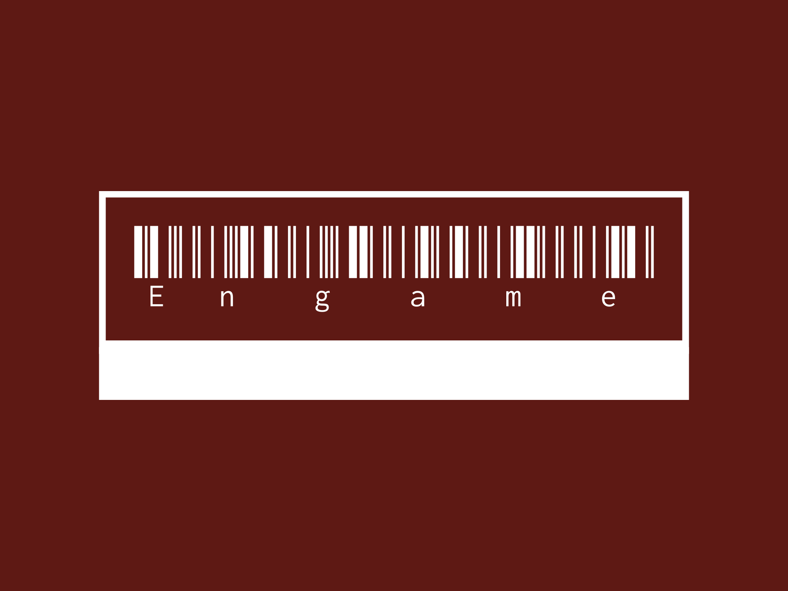
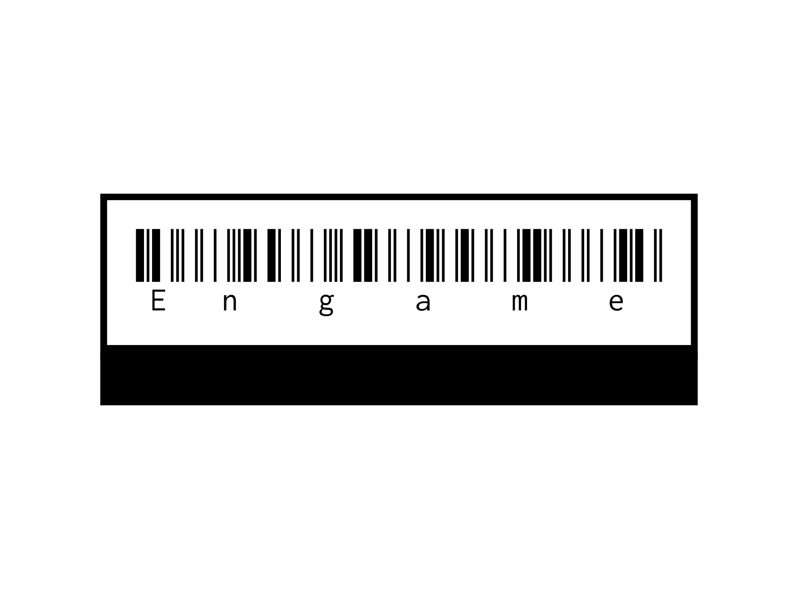

# Engame

## A demo of a video game ecommerce website, built using React, Express, Mongoose, MongoDB, and JavaScript.

# Link to App:
# Link to Trello: https://trello.com/b/SHFIVr2J/mod-3-project

### Main features of the app:
    - User Login/Logout
    - JWT based authentication system for users
    - API Calls from RAWG Video Game API database
    - Order History accurately displays orders using last 5 characters of Order IDs for easy tracking
    - Cart accurately tracks items & totals
    - Username is displayed in the navbar to show user is logged in correctly

## Code Discussion

### Main/Central Mongoose Model: 
order.cjs, a schema for orders, I feel like it's a very solid schema, after I wrote it I didn't have problems with it, I only had to add to it.

### Favorite Express Controller Method: 
The Create method I have in /controllers/api/orders.cjs, just because when I got it working, it was a good feeling.

### Favorite React Component: 
I spent so much time in GameListPage.jsx that it's definitely my favorite, but I like Navbar.jsx too.

### Client-Side Routing:
    /games - New Order route, lists API returns for genres and when you click a genre, displays a couple games for that genre

    /orders - Shows the history of past orders, if the user has any.

    /cart - Shows items in a user's cart if they selected to "purchase" any.
As always with React-Router, navigation between these pages is seamless, and specific routes have authentication guards to prevent not-logged in users from seeing them.

### What was my biggest challenge?
Mostly getting the API to show up, and working with CSS. With this app took me a lot of time since I wanted it to be at least moderately responsively-designed. I also ran into an issue with having the Cart.jsx show up on the same page as the GameListPage.jsx, because the props wouldn't pass properly for game information. So I just moved the cart to its own page, and everything worked off the bat, so I just left it that way.

### What are my biggest takeaways from this project?
Definitely learning how to troubleshoot a backend application and learning how the stack calls worked. I got to the point where I could narrow an issue pretty quickly (< 10 minutes I'd say) but it did depend on the issue. Also for console errors, I still have trouble tracking down the flow of information between files in backend to frontend, so I'll need to work on that.

Credits:
Robert Michaud, Creator of the Engame© website

Fonts: https://fonts.google.com/

Logo: https://app.logo.com/

Powered by RAWG Games API (https://rawg.io/apidocs)

Per Scholas (https://perscholas.org/) for teaching me everything needed to complete this project
